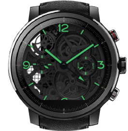

# Panerai Lo Scenziato
Amazfit Stratos watchface.

## Previews:



## How to use
- Download this repo;
- Open a terminal:
```bash
cd /path/to/watchface;
zip whatever-you-want.wfz ./*
```
- Copy the *.wfz file to your Amazfit Stratos.
- Set the watchface through the menu. 

## Author
[Davide Caruso](https://davidecaruso.github.io)

## License
Licensed under [MIT](LICENSE).